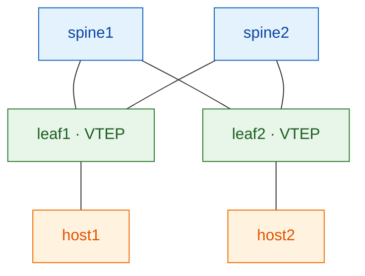

# NetForge Labs

**Learn networking by building it.** Hands-on, lab-driven courses where you stand
up real network fabrics, break them on purpose, and understand *why* every line of
config is there — not just what to paste.

!!! tip "The NetForge method"
    Every topic follows the same rhythm: **mental model → why before how →
    the mechanism (deep) → build it in a lab → verify (and read the output) →
    break & observe → lessons & interview questions.** You finish able to design
    it *and* troubleshoot it.

---

## Course catalog

### ▶ Course 1 — VXLAN-EVPN on Juniper &nbsp; ✅ available

Build a production data-center fabric on **Juniper vJunos-switch**, in
**containerlab**, from bare nodes to a working overlay — session by session.

- **[Start the Course →](sessions/index.md)** — the guided, session-by-session path
- **[Quick concepts](study/index.md)** — 5-minute primers + interview questions
- **[Labs](labs.md)** — the runnable fabrics
- **[Host setup](host-setup/00-gcp-instance.md)** — GCP + containerlab + vJunos

*Topics:* underlay (OSPF/IS-IS/eBGP) · overlay (iBGP-EVPN + route reflectors) ·
L2VNI · anycast gateway · multi-tenancy · ESI multihoming · external connectivity
· multi-site.

### 🔜 Course 2 — VXLAN-EVPN on Cisco &nbsp; *(planned)*

The same fabric concepts on **Cisco Nexus** (NX-OS) — so you can compare the two
vendors side by side. Coming after Course 1's sessions are complete.

*Further out:* segment routing, EVPN multihoming deep-dives, automation. The
platform is built to add courses without reshaping what's here.

---

## How a course is structured

| Layer | What it is | Where |
|-------|-----------|-------|
| **Course** | The deep, guided path — session by session | [sessions/](sessions/index.md) |
| **Study** | Short concept primers + interview bank | [study/](study/index.md) |
| **Labs** | The runnable fabrics each session drives | [labs.md](labs.md) |

New to the topic? **Start with the [Course](sessions/index.md).** Just need a
refresher on one idea? Hit the [Study primers](study/index.md).

---

## Get started

1. **Set up a lab host** — [GCP + containerlab + vJunos](host-setup/00-gcp-instance.md) (one-time).
2. **Open [Course 1, Session 1](sessions/01-underlay.md)** and build the underlay.
3. Work session by session; each ends with a checkpoint you must pass.

> Source, configs, and scripts live in the
> [GitHub repo](https://github.com/etherhtun/netforge-labs). Never commit the
> vJunos image or credentials (see the repo's `.gitignore`).
