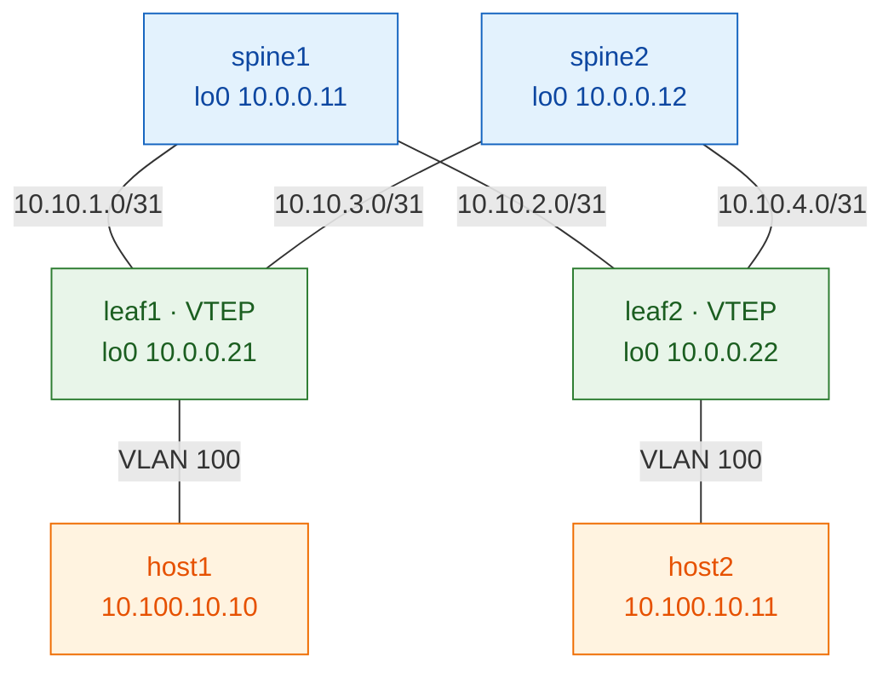

# VXLAN-EVPN on Juniper — Zero to Hero

Welcome. This is a hands-on learning path for building VXLAN-EVPN fabrics on
**Juniper vJunos-switch**, running in **containerlab** on a **GCP VM**.

> Learn by building, not by pasting. Each layer is a checkpoint you *verify*
> before moving on. The fabric is built bottom-up — underlay first, then the
> overlay, then services — because that is the order in which it actually
> becomes real.

---

## The labs

Four routing-design variants, all on the same 2-spine × 2-leaf topology:

| Lab | Underlay | Overlay | Status |
|-----|----------|---------|--------|
| **01** | OSPF | iBGP-EVPN (full mesh) | 🏗️ in progress |
| **02** | IS-IS | iBGP-EVPN | 📋 planned |
| **03** | eBGP | iBGP-EVPN | 📋 planned |
| **04** | eBGP | eBGP-EVPN | 📋 planned |

Each lab is built layer-by-layer through 5 steps. Verify before you move on.

## The topology

All labs share the same 2 spine × 2 leaf fabric — only the routing design
changes between them.



---

## Quick start

1. **Set up the host** (if you haven't already):
   - [GCP instance with nested virtualization](host-setup/00-gcp-instance.md)
   - [Docker, containerlab, and vJunos image](host-setup/01-containerlab.md)

2. **Deploy a lab**:
   ```bash
   ./scripts/deploy.sh 01-ospf-ibgp
   ```
   vJunos nodes boot in ~5–8 minutes. Watch the logs in another terminal.

3. **Work through the steps** — see the [Labs](labs.md) page for lab 01's
   step-by-step guide. Each step has a concept, config, and verify commands.

4. **Reset if needed**:
   ```bash
   ./scripts/reset.sh 01-ospf-ibgp    # destroy and redeploy clean
   ./scripts/switch.sh 01-ospf-ibgp   # push the full working config (skip the hand-typing)
   ```

---

## The learning principle

```
lo0 reachable (ping)  →  BGP Establ  →  Type-3 + tunnel up  →  Type-2  →  host ping
     ▲                       ▲                 ▲                  ▲
  underlay               overlay            evpn/vxlan         services
```

Each arrow is a `show` command. If an arrow is broken, the fault is *at that
layer* — you never debug the whole stack at once.

---

## Next steps

- **New to EVPN?** Start with [Concepts — EVPN-VXLAN Primer](concepts/evpn-vxlan-primer.md).
- **Host not ready yet?** Read [Host Setup](host-setup/00-gcp-instance.md).
- **Ready to deploy?** Jump to the [Labs](labs.md) page.

---

## Repository

All code, configs, and scripts are in the GitHub repo:
[etherhtun/vxlan-evpn-juniper](https://github.com/etherhtun/vxlan-evpn-juniper)

Never commit:
- vJunos `.qcow2` images (licence violation)
- Juniper credentials or licence keys
- GCP service-account JSON files

All covered by `.gitignore`.
