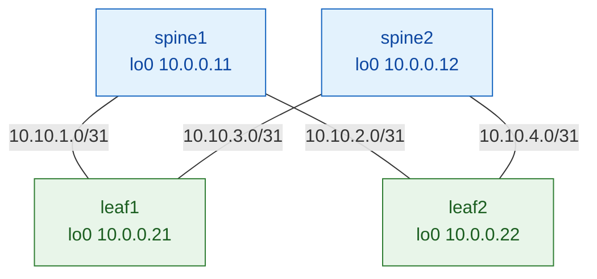

# Session 1 — The Underlay (OSPF)

> **Goal:** build the routed foundation that every VXLAN tunnel will ride on, and
> understand *why* it's built this way. By the end, every switch's loopback can
> reach every other over two equal paths — and you'll know exactly what makes
> that true.

---

## 1. Mental model

Think of the underlay as a **motorway network** between cities. The cities are the
switches; each city has one permanent **address that never changes** (its
loopback). The motorways (fabric links) connect them, and there are **two ways to
get anywhere** (via either spine) so traffic can spread and survive a closure.

The motorway doesn't care *what* is being shipped — trucks (VXLAN packets) just
need to get from one city to another. That indifference is the point: the underlay
moves IP packets between loopbacks and knows nothing about tenants, VLANs, or MACs.

---

## 2. Why before how

**Why a routed (L3) underlay at all — why not just switch everything?**
A big flat Layer-2 network relies on spanning tree, which *blocks* redundant links
to prevent loops. In a fabric with many parallel paths, that wastes half your
capacity and creates large failure domains. Routing has no such problem: every
link is active, and loops are handled by TTL and the routing algorithm. So we
route between spines and leaves, and carry Layer-2 *on top* as an overlay (later
sessions).

**Why loopbacks?**
A physical interface goes down when its cable/neighbour fails. A **loopback is a
virtual interface that stays up as long as the box is up**. We want a switch's
identity and its VXLAN tunnel endpoint to be reachable via *any* available path,
not tied to one cable — so we anchor them to the loopback and let routing find a
way there.

**Why /31 on the links?**
A point-to-point link has exactly two endpoints. A `/31` provides exactly two
usable addresses (RFC 3021) — no waste. A `/30` would burn two extra addresses
(network + broadcast) on every link.

**Why a routing protocol (OSPF) instead of static routes?**
Static routes don't react to failure. OSPF **automatically recomputes** paths when
a link drops, and **discovers all equal-cost paths** for load spreading. On a
fabric that changes state, that automation is essential.

**Why OSPF specifically (here)?**
It's the simplest thing that gives us fast, automatic, multipath reachability. IS-IS
(Session 7's cousin) and eBGP are alternatives with different scaling trade-offs —
we compare them later. OSPF lets us focus on *the fabric idea* first without BGP's
ceremony.

---

## 3. The mechanism (technical depth)

### What OSPF actually does
OSPF is a **link-state** protocol. Every router describes its own links in a
**Link-State Advertisement (LSA)** and floods it to all others. Each router
therefore ends up with an identical **map** of the whole area (the link-state
database), and independently runs **Dijkstra's shortest-path-first (SPF)**
algorithm over that map to compute the best route to every destination.

Key consequence: because everyone shares the same map and the same algorithm,
they compute **consistent, loop-free** paths — and when they find *several* paths
of equal cost, they install **all of them** (ECMP).

### The neighbour state machine
Two OSPF routers don't just start exchanging routes — they climb a state machine
first. You'll watch this in the verify step, so know the states:

```
Down → Init → 2-Way → ExStart → Exchange → Loading → Full
```
- **Init / 2-Way** — hellos seen; bidirectional communication confirmed.
- **ExStart / Exchange** — they agree who's master and swap database descriptions.
- **Loading / Full** — they request and install each other's LSAs. **`Full` means
  the adjacency is complete** and routes can be trusted. Anything stuck below
  `Full` is a problem.

### Point-to-point network type
By default OSPF treats an Ethernet link as a *broadcast* network and elects a
Designated Router (DR) — machinery meant for shared segments with many routers. A
fabric link has exactly **two** routers, so that election is pure overhead and
adds seconds to convergence. Declaring the link **point-to-point** skips the DR
election entirely — faster, simpler, correct for a fabric.

### Passive loopback
We want the loopback's `/32` **advertised** into OSPF (so everyone can reach it),
but there's no OSPF neighbour living on a loopback to talk to. Marking it
**passive** means "advertise this network, but don't send/expect hellos here." Skip
it and OSPF wastes effort trying to form an adjacency that can never exist.

### ECMP — why two spines matter
Each leaf connects to *both* spines, so there are **two equal-cost paths** to any
remote loopback. OSPF installs both. When VXLAN traffic flows later, the hardware
hashes each flow (using that UDP source-port entropy you'll meet in Session 3)
across the two paths — **all links carry traffic, none are blocked.** That is the
whole reason a routed fabric beats spanning tree.

---

## 4. Build it

**Topology:** 2 spines, 2 leaves, `/31` fabric links, `/32` loopbacks.



**Deploy the fabric and drive the lab:** this session builds the underlay portion
of [Lab 01](../labs/lab-01-fullmesh.md).
```bash
./scripts/deploy.sh 01-ospf-ibgp
./scripts/apply.sh  01-ospf-ibgp 01     # Step 1: interfaces + loopbacks
./scripts/apply.sh  01-ospf-ibgp 02     # Step 2: OSPF
```

**Is the fabric ready?** vJunos takes ~5–8 min/node to boot. Check:
```bash
docker ps --filter "name=clab-evpn-fullmesh" --format "table {{.Names}}\t{{.Status}}"
```
Wait until all four switches show `(healthy)`. (You don't have to wait manually —
`apply.sh` holds for each node's CLI before pushing.)

**Prefer to skip the per-step learning and just build it?**
```bash
./scripts/apply.sh 01-ospf-ibgp all     # runs Steps 01→05 in order, one command
```
Steps are **cumulative** — each layer builds on the one below. To jump to a
particular point, apply a **range** (which includes the prerequisites):
```bash
./scripts/apply.sh 01-ospf-ibgp 01-03   # steps 01 → 03 in order (e.g. up to the overlay)
```
A single step (`apply.sh 01-ospf-ibgp 03`) only works if the earlier steps are
already applied — step 3 (BGP) needs the loopbacks (1) and underlay (2) first.

**Config, explained — leaf1** (every node in [Lab 01](../labs/lab-01-fullmesh.md)):
```
set interfaces ge-0/0/0 unit 0 family inet address 10.10.1.1/31   # link to spine1
set interfaces ge-0/0/1 unit 0 family inet address 10.10.3.1/31   # link to spine2
set interfaces lo0 unit 0 family inet address 10.0.0.21/32        # identity + future VTEP
set routing-options router-id 10.0.0.21                           # pin OSPF/BGP router-id
set protocols ospf area 0 interface lo0.0 passive                 # advertise, don't peer
set protocols ospf area 0 interface ge-0/0/0.0 interface-type p2p # skip DR election
set protocols ospf area 0 interface ge-0/0/1.0 interface-type p2p
```
Each line maps to a decision from §2–3: the `/31`s, the `/32` loopback, the pinned
router-id, `passive`, and `p2p`.

---

## 5. Verify — and how to read it

### Neighbours reached `Full`
```
leaf1> show ospf neighbor
Address     Interface       State   ID          Pri  Dead
10.10.1.0   ge-0/0/0.0      Full    10.0.0.11   128   36
10.10.3.0   ge-0/0/1.0      Full    10.0.0.12   128   38
```
Read it: **two** neighbours (both spines), both **`Full`** — adjacencies complete.
The `ID` is each spine's router-id. If you saw `ExStart` or `Init` here, the
adjacency never finished forming (MTU mismatch and wrong network type are the
usual causes).

### The route exists, with *two* next-hops (ECMP)
```
leaf1> show route 10.0.0.22

10.0.0.22/32   *[OSPF] 00:03:11, metric 2
                  to 10.10.1.0 via ge-0/0/0.0     ← via spine1
                  to 10.10.3.0 via ge-0/0/1.0     ← via spine2
```
Two next-hops for one destination = ECMP is working. Both spines are viable paths
to leaf2's loopback. **This is the proof the fabric will load-balance.**

### The gate — loopback-to-loopback ping
```
leaf1> ping 10.0.0.22 source 10.0.0.21 count 3
64 bytes from 10.0.0.22: icmp_seq=0 ttl=63 time=7.3 ms
```
`ttl=63` (not 64) tells you the packet **crossed one router (a spine)** to get
there — proof it really traversed the fabric rather than a shortcut. **If this
ping works, the underlay is done.**

---

## 6. Break & observe

Predict first, then run.

**Drop one fabric link:**
```
leaf1# deactivate protocols ospf area 0 interface ge-0/0/0    ; commit
```
- **Predict:** does `10.0.0.22` stay reachable?
- **Observe:** `show ospf neighbor` — the spine1 adjacency disappears. `show route
  10.0.0.22` — the route survives with a **single** next-hop (via spine2). The
  ping keeps working. You've just watched OSPF **re-run SPF and reconverge** onto
  the surviving path — automatically, in well under a second.
- **Reverse:** `activate protocols ospf area 0 interface ge-0/0/0 ; commit` — the
  second next-hop reappears; ECMP restored.

This is the payoff of §2's "why a routing protocol": failure handling for free.

---

## 7. Lessons & interview

**vJunos gotchas (from the live build):**
- Interfaces are `ge-0/0/N`; containerlab `ethN` → `ge-0/0/(N-1)`.
- Right after `commit`, `show ospf neighbor` may say *"OSPF instance is not
  running"* — that's just timing; wait ~30 s.
- `family inet` applies cleanly on `ge-` ports (no `ethernet-switching` to remove).

**Interview questions:**
1. Why does a routed underlay use every link while spanning tree doesn't?
2. What does OSPF state `Full` mean, and name two reasons an adjacency stalls before it.
3. Why declare fabric links point-to-point?
4. You see two next-hops for one `/32` in `show route`. What does that tell you, and why does it matter for VXLAN?
5. Why anchor the router-id and VTEP to a loopback rather than a physical interface?

---

**Next:** [Session 2 — The overlay (iBGP-EVPN + route reflectors)](index.md), where
the leaves start advertising reachability to each other and the fabric grows a
brain.
