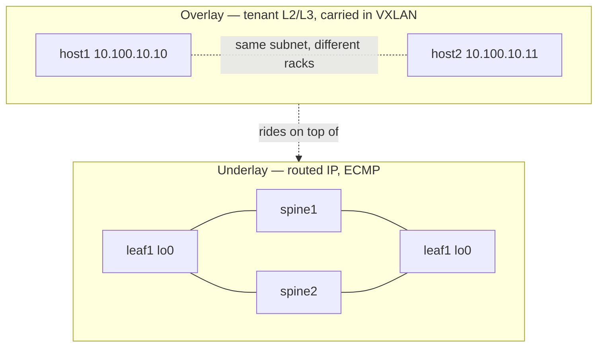

# 2 — Underlay vs overlay

This is the single most important idea in the whole topic. Get it and everything
else clicks.

## Two networks, stacked

A VXLAN-EVPN fabric is **two networks running at once**, on the same physical
boxes:

| | Underlay | Overlay |
|---|----------|---------|
| **What it is** | The physical, routed IP network | The virtual L2/L3 network tenants actually use |
| **Its only job** | Get packets from one VTEP loopback to another | Carry tenant MACs/IPs across those tunnels |
| **Who's on it** | Spines + leaves (loopbacks, /31 links) | Hosts, VLANs, VNIs |
| **Protocol** | OSPF / IS-IS / eBGP | BGP-EVPN + VXLAN encapsulation |
| **Addresses** | 10.0.0.x loopbacks, 10.10.x.x links | 10.100.x.x tenant subnets |

## The analogy

- **Underlay = the road network.** Plain, well-connected, many routes between any
  two points (ECMP). It doesn't know or care what's being shipped.
- **Overlay = the mail system.** Envelopes (tenant frames) get wrapped in a
  shipping box (VXLAN) addressed **VTEP-to-VTEP**, dropped on the roads, and
  unwrapped at the destination.

The mail system doesn't need new roads — it *rides on* the roads that exist.
That's why the underlay only has to do **one thing well: make every VTEP
loopback reachable from every other**, with multiple equal paths.

## VTEP — where the two layers meet

A **VTEP** (VXLAN Tunnel EndPoint) is the device that sits on the boundary:

- On its **overlay** side, it has tenant VLANs and host ports.
- On its **underlay** side, it has a loopback IP.
- Its job: **encapsulate** a tenant frame into VXLAN (add the shipping box) and
  **decapsulate** it at the far end.

In a spine-leaf fabric, **the leaves are the VTEPs.** The **spines are pure
underlay** — they just route IP packets between loopbacks and never look inside
the VXLAN box. (You saw this in the lab: spines ran only OSPF; leaves did EVPN.)

## Why separate them?

Because each layer can change independently:

- Swap the underlay protocol (OSPF → IS-IS → eBGP) without touching the overlay.
  **That is exactly what labs 01–04 do.**
- Add tenants/VNIs in the overlay without re-engineering the physical network.

## Check yourself

1. What is the underlay's one and only job?
2. Where in a spine-leaf fabric are the VTEPs, and what do the spines do?
3. Why does separating underlay from overlay let you change one without the other?

→ Next: [VXLAN data plane](03-vxlan-dataplane.md)
