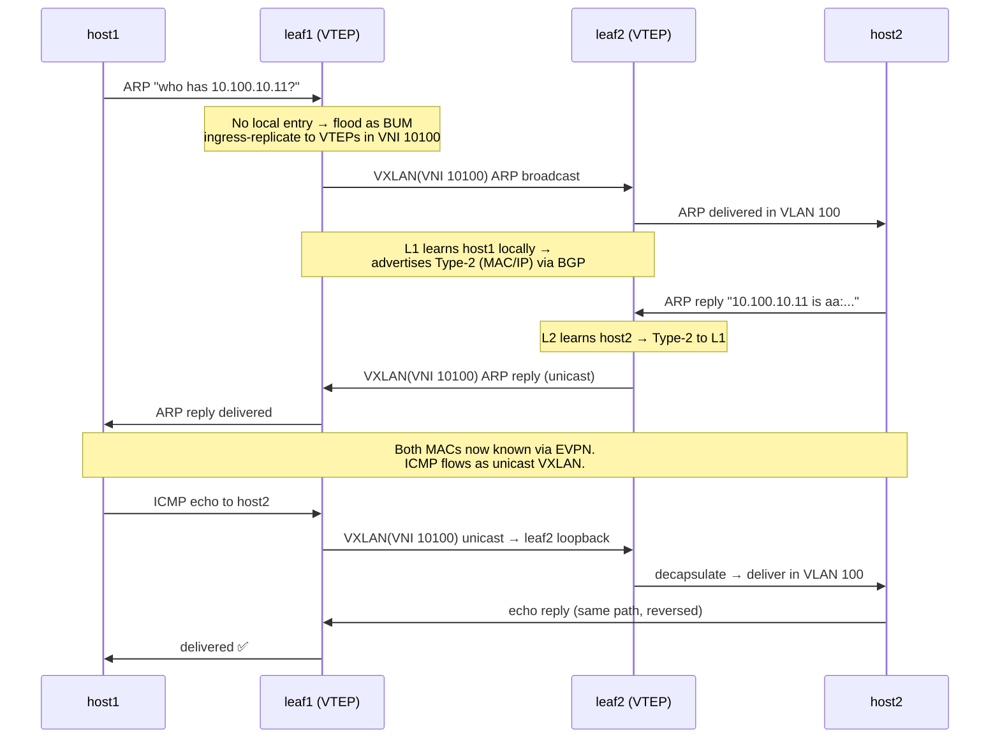

# 6 — Packet walk

Time to put it all together. We'll trace **exactly** what happens when host1
(on leaf1) pings host2 (on leaf2) for the first time — same subnet, one L2VNI.
This is the story behind the `ping` you ran at the end of the lab.

**Setup:** host1 `10.100.10.10` on leaf1, host2 `10.100.10.11` on leaf2, both in
VLAN 100 → VNI 10100. VTEPs: leaf1 `10.0.0.21`, leaf2 `10.0.0.22`.

## Before any host talks — control plane primes

1. Each leaf's access port comes up in VLAN 100 → each advertises a **Type-3
   (IMET)** route for VNI 10100.
2. The leaves learn each other as VTEPs for VNI 10100 and build a VXLAN tunnel
   (and a BUM flood list) between their loopbacks.

Nothing has pinged yet, but the fabric is *ready*.

## Now host1 pings host2

## Step by step, in words

1. **host1 ARPs** for host2's IP — a broadcast in VLAN 100.
2. **leaf1 has no entry**, so it treats the ARP as **BUM**: ingress-replicates it
   as a VXLAN packet (VNI 10100) to every VTEP in that VNI — here, just leaf2.
3. **leaf2 decapsulates** and delivers the ARP into its VLAN 100. host2 sees it.
4. Meanwhile **leaf1 learned host1** locally and **advertises a Type-2** route
   (host1's MAC/IP behind VTEP 10.0.0.21) over BGP-EVPN.
5. **host2 replies.** leaf2 learns host2, **advertises a Type-2** for it, and
   unicasts the reply back over the tunnel to leaf1 → host1.
6. Now **both leaves know both hosts via EVPN** (Type-2). The actual ICMP echo
   goes as **unicast VXLAN**: leaf1 wraps it (dst = leaf2's loopback), the
   underlay routes it (maybe via either spine — ECMP), leaf2 unwraps and delivers.
7. Every subsequent packet is a straight unicast VXLAN encap/decap. No more
   flooding.

## What you'd see on the boxes (and did, in the lab)

| Moment | Command | What shows up |
|--------|---------|---------------|
| Access port up | `show route table bgp.evpn.0` | Type-3 from both leaves |
| Tunnel formed | `show ethernet-switching vxlan-tunnel-end-point remote` | RVTEP + VNID 10100 |
| After ping | `show evpn database` | Type-2 for both hosts (MAC + IP) |
| After ping | `show ethernet-switching table` | remote MAC flagged `DR` via `vtep.xxxxx` |

## The whole thing in one breath

> Access ports up → **Type-3** builds the flood list & tunnel → host ARP floods
> once via ingress replication → **Type-2** teaches both leaves where each host
> is → from then on it's plain **unicast VXLAN** encap/decap over an ECMP
> underlay. ARP suppression means even that first flood often isn't needed after
> the control plane has learned the hosts.

## Check yourself

1. What's the difference between how the *first* ARP and the *subsequent* ICMP
   packets cross the fabric?
2. At which step does a Type-2 route get generated, and by which leaf?
3. If ARP suppression is active, what changes about step 2?

→ You're ready. Go build it: **[the Lab](../labs.md)** — or test yourself with the
**[interview questions](interview-questions.md)**.
