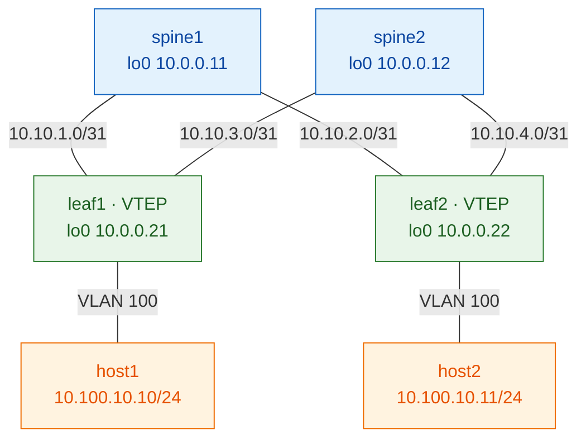
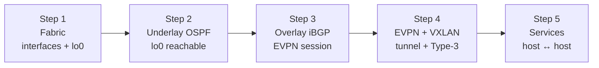

# Lab 01 — OSPF underlay + iBGP-EVPN (full mesh)

The foundational lab. Build a working VXLAN-EVPN fabric from bare vJunos nodes,
one layer at a time, verifying at every step.

## Design

| Layer    | Choice |
|----------|--------|
| Underlay | OSPF (single area 0) |
| Overlay  | iBGP-EVPN, AS 65000, **leaf-to-leaf full mesh** |
| Spines   | underlay transport only — no EVPN, no VTEP |
| Services | one L2VNI (VLAN 100 → VNI 10100), two hosts same subnet |

See [`../../common/ipplan.md`](../../common/ipplan.md) for all addresses.

## Physical topology

2 spine × 2 leaf, full-mesh fabric. Each leaf dual-homes to both spines over
`/31` links; one host hangs off each leaf in VLAN 100.



## How the layers stack

Each step adds one layer on top of the last. The diagram on the right of each
step shows what that layer introduces.



## The build (follow `steps/` in order)

| Step | File | Verifies before you continue |
|------|------|------------------------------|
| 1 | [steps/01-fabric.md](steps/01-fabric.md)          | interfaces up, loopbacks present |
| 2 | [steps/02-underlay-ospf.md](steps/02-underlay-ospf.md) | `lo0` ping leaf-to-leaf |
| 3 | [steps/03-overlay-ibgp.md](steps/03-overlay-ibgp.md)   | BGP EVPN session `Established` |
| 4 | [steps/04-evpn-vxlan.md](steps/04-evpn-vxlan.md)       | Type-3 route + VXLAN tunnel up |
| 5 | [steps/05-services-verify.md](steps/05-services-verify.md) | host1 ↔ host2 across the fabric |

Then: [`verify.md`](verify.md) (full checklist) and
[`break-it.md`](break-it.md) (deliberate failures).

## Two ways to run it

```bash
# Learning path — bare fabric, type each layer yourself:
./scripts/deploy.sh 01-ospf-ibgp
#   ... then work through steps/01 → 05

# Reset button — push the full working config at once:
./scripts/switch.sh 01-ospf-ibgp
```

> `configs/*.conf` (the full working configs) and `steps/*.md` (the by-hand
> layers) describe the **same** end state — stacking the steps equals the
> config file.

## Status

🏗️ Scaffold in place. Step content + configs are stubs — filled in one layer
at a time, each validated on a live fabric before the next is written.
