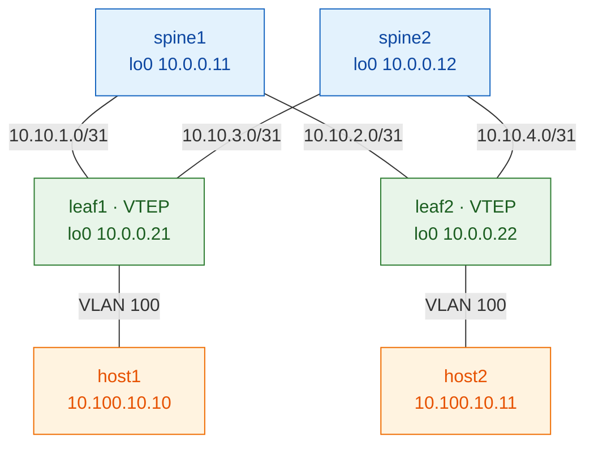

# Lab 01 — OSPF underlay + iBGP-EVPN (full mesh)

> **Complete, self-contained guide.** Build a working VXLAN-EVPN fabric from bare
> vJunos switches, one layer at a time. Read [the Study track](https://etherhtun.github.io/vxlan-evpn-juniper/study/)
> first for the theory; this lab is the hands-on part.
>
> ✅ Validated end-to-end on vJunos-switch 23.2R1.14.

This is the **foundational** lab. It uses the simplest overlay — a full mesh
between the two leaves — so you can see EVPN in its clearest form. (The
[production version](../02-ospf-ibgp-rr/README.md) swaps that for spine
route-reflectors.)

---

## What you'll build

| Layer    | Choice |
|----------|--------|
| Underlay | OSPF, single area 0 |
| Overlay  | iBGP-EVPN, AS 65000, **leaf-to-leaf full mesh** (spines carry no EVPN) |
| Services | one L2VNI: VLAN 100 → VNI 10100, two hosts in one subnet |



**Addresses** (full plan in [common/ipplan.md](../../common/ipplan.md)):

| Device | lo0 (router-id / VTEP) | to spine1 | to spine2 |
|--------|------------------------|-----------|-----------|
| spine1 | 10.0.0.11 | — | — |
| spine2 | 10.0.0.12 | — | — |
| leaf1  | 10.0.0.21 | 10.10.1.1/31 | 10.10.3.1/31 |
| leaf2  | 10.0.0.22 | 10.10.2.1/31 | 10.10.4.1/31 |

> **Interfaces:** vJunos-switch uses `ge-0/0/N`. containerlab `eth1→ge-0/0/0`,
> `eth2→ge-0/0/1`, `eth3→ge-0/0/2` (a +1 offset). **Login:** `admin` / `admin@123`.

---

## Before you start

- Host set up (GCP + containerlab + vJunos image) — see
  [Host Setup](https://etherhtun.github.io/vxlan-evpn-juniper/host-setup/00-gcp-instance/).
- **This lab runs on its own fabric** (`clab-evpn-fullmesh-*`). Only run **one
  lab at a time** — a 2×2 vJunos fabric needs ~16 GB RAM. If another lab is
  running, wipe it first: `./scripts/destroy.sh <that-lab>`.

## How to run it

```bash
./scripts/deploy.sh 01-ospf-ibgp        # boot the fabric (~5-8 min/node)

# then EITHER build it all at once:
./scripts/apply.sh 01-ospf-ibgp all

# OR learn by hand — type each step below yourself, or one step at a time:
./scripts/apply.sh 01-ospf-ibgp 02      # e.g. just Step 2
```
Wipe or redo:
```bash
./scripts/destroy.sh 01-ospf-ibgp       # wipe (no redeploy)
./scripts/reset.sh   01-ospf-ibgp       # wipe + redeploy clean
```

To do it by hand: `ssh admin@clab-evpn-fullmesh-leaf1` (password `admin@123`),
`configure`, paste the step's block, `commit`.

---

# The build

Do the steps in order. **Each ends with a check you must pass before the next.**

```
lo0 reachable (ping) → BGP Establ → Type-3 + tunnel → Type-2 → host ping
       Step 2            Step 3        Step 4/5         Step 5    Step 5
```

## Step 1 — Fabric: interfaces & loopbacks

**Why:** every switch needs its fabric-link `/31` IPs and a `/32` loopback. On a
leaf, `lo0` is the router-id, the BGP peering address, **and** the VXLAN tunnel
source — the single most important address on the box.

**spine1**
```
set interfaces ge-0/0/0 unit 0 family inet address 10.10.1.0/31
set interfaces ge-0/0/1 unit 0 family inet address 10.10.2.0/31
set interfaces lo0 unit 0 family inet address 10.0.0.11/32
set routing-options router-id 10.0.0.11
```
**spine2**
```
set interfaces ge-0/0/0 unit 0 family inet address 10.10.3.0/31
set interfaces ge-0/0/1 unit 0 family inet address 10.10.4.0/31
set interfaces lo0 unit 0 family inet address 10.0.0.12/32
set routing-options router-id 10.0.0.12
```
**leaf1**
```
set interfaces ge-0/0/0 unit 0 family inet address 10.10.1.1/31
set interfaces ge-0/0/1 unit 0 family inet address 10.10.3.1/31
set interfaces lo0 unit 0 family inet address 10.0.0.21/32
set routing-options router-id 10.0.0.21
```
**leaf2**
```
set interfaces ge-0/0/0 unit 0 family inet address 10.10.2.1/31
set interfaces ge-0/0/1 unit 0 family inet address 10.10.4.1/31
set interfaces lo0 unit 0 family inet address 10.0.0.22/32
set routing-options router-id 10.0.0.22
```
**Verify** (leaf1): `show interfaces terse | match "ge-|lo0"` (links up/up), then
`ping 10.10.1.0 count 3` — the directly-connected `/31` replies.
**✅ Checkpoint:** links up, loopbacks present, `/31` pings → Step 2.

## Step 2 — Underlay: OSPF

**Why:** the underlay's one job is to make every loopback reachable from every
other, over both spines (ECMP). Loopbacks are advertised *passive* (announced,
but no neighbour to form there); fabric links are point-to-point.

**Identical on all four switches:**
```
set protocols ospf area 0 interface lo0.0 passive
set protocols ospf area 0 interface ge-0/0/0.0 interface-type p2p
set protocols ospf area 0 interface ge-0/0/1.0 interface-type p2p
```
**Verify** (leaf1):
```
show ospf neighbor                → both spines in state Full
ping 10.0.0.22 source 10.0.0.21   → leaf-to-leaf loopback; MUST succeed (ttl=63 = one spine hop)
```
**✅ Checkpoint:** loopback-to-loopback ping works → Step 3. *If it fails, stop —
nothing above works without the underlay.*

## Step 3 — Overlay: iBGP-EVPN (full mesh)

**Why:** the overlay is a BGP session carrying the `evpn` family, so leaves learn
each other's hosts without flooding. In full mesh the **leaves peer directly with
each other** (one session for two leaves); the **spines run no EVPN**.

**leaf1**
```
set routing-options autonomous-system 65000
set protocols bgp group overlay type internal
set protocols bgp group overlay local-address 10.0.0.21
set protocols bgp group overlay family evpn signaling
set protocols bgp group overlay neighbor 10.0.0.22
```
**leaf2** — mirror: `local-address 10.0.0.22`, `neighbor 10.0.0.21`.
**Verify** (leaf1): `show bgp summary` → peer `10.0.0.22` **Establ**, table
`bgp.evpn.0` present. **0 routes is correct** (no VXLAN yet).
> The `License key missing; requires 'bgp'` warning is a benign vJunos-eval message.
**✅ Checkpoint:** EVPN session Establ → Step 4.

## Step 4 — EVPN + VXLAN glue

**Why:** this turns on the VTEP. `protocols evpn` picks VXLAN + which VNIs;
`switch-options` sets the tunnel source (`lo0.0`), the RD (unique per leaf) and RT
(shared per VNI); and a VLAN→VNI mapping bridges VLAN 100 onto VNI 10100.
Leaves only — spines are not VTEPs.

**leaf1** (leaf2 mirrors, RD `10.0.0.22:1`)
```
set protocols evpn encapsulation vxlan
set protocols evpn extended-vni-list all
set switch-options vtep-source-interface lo0.0
set switch-options route-distinguisher 10.0.0.21:1
set switch-options vrf-target target:65000:1
set vlans v100 vlan-id 100
set vlans v100 vxlan vni 10100
```
**⚠️ Expect NO routes yet.** `show route table bgp.evpn.0` is still empty — this
is correct. **Junos only advertises a VNI once its VLAN has an up member
interface** (unlike Cisco). It lights up in Step 5.
**Verify:** `show configuration vlans` / `switch-options` present;
`show bgp summary` now lists `default-switch.evpn.0`.
**✅ Checkpoint:** EVPN instance appears → Step 5.

## Step 5 — Services: attach hosts & prove it

**Why:** put the host ports into VLAN 100. The moment the port is up, the leaf
advertises its **Type-3 (IMET)** route, the VXLAN tunnel forms, and once hosts
talk, **Type-2 (MAC/IP)** routes teach both leaves where each host is.

**5a — access ports, leaf1 and leaf2 (same):**
```
set interfaces ge-0/0/2 unit 0 family ethernet-switching interface-mode access
set interfaces ge-0/0/2 unit 0 family ethernet-switching vlan members v100
```
Confirm (leaf1): `show route table bgp.evpn.0` → two Type-3 (`3:`) routes;
`show ethernet-switching vxlan-tunnel-end-point remote` → tunnel to the other leaf.

**5b — host IPs (on the clab host shell, not Junos):**
```
docker exec clab-evpn-fullmesh-host1 sh -c "ip addr add 10.100.10.10/24 dev eth1; ip link set eth1 up"
docker exec clab-evpn-fullmesh-host2 sh -c "ip addr add 10.100.10.11/24 dev eth1; ip link set eth1 up"
docker exec clab-evpn-fullmesh-host1 ping -c3 10.100.10.11
```
**✅ Checkpoint — the finish line:** 0% packet loss across the VXLAN fabric. 🎉

---

## Verify checklist

- [ ] `show ospf neighbor` — every fabric link `Full`
- [ ] `ping 10.0.0.22 source 10.0.0.21` — leaf-to-leaf loopback
- [ ] `show bgp summary` — EVPN peer `Establ`
- [ ] `show route table bgp.evpn.0` — Type-3 then Type-2 routes (after Step 5)
- [ ] `show ethernet-switching vxlan-tunnel-end-point remote` — tunnel up
- [ ] `show ethernet-switching table` — remote host MAC flagged `DR` via `vtep.xxxxx`
- [ ] host1 → host2 ping — 0% loss

## Break-it exercises

Predict the symptom, break it, find the `show` that exposes it, then fix it.

1. **Underlay link:** `deactivate interfaces ge-0/0/0` on leaf1 → loopback stays
   reachable via the other spine (`show route 10.0.0.22`). Reactivate.
2. **BGP source:** point `local-address` at the wrong IP → session never
   Establishes (`show bgp summary`). Restore.
3. **VNI mismatch:** set leaf2's VLAN 100 to `vni 10199` → tunnel/host ping breaks
   (`show evpn database`). Restore to 10100.
4. **VTEP source:** `delete switch-options vtep-source-interface` on leaf1 →
   Type-3 withdrawn, tunnel drops. Restore `lo0.0`.

## Lessons from the live build

- Interfaces are **`ge-0/0/N`**; clab `ethN` → `ge-0/0/(N-1)`.
- `family inet` commits clean on `ge-` ports (no `ethernet-switching` to delete).
- ⭐ **Junos originates Type-3 only when the VLAN has an up member** — biggest
  difference vs Cisco; the tunnel appears at Step 5, not Step 4.
- Management (`fxp0`) is on `10.0.0.0/24`, overlapping the loopbacks but isolated
  in the `mgmt_junos` instance — harmless.
- "OSPF instance is not running" right after commit is just timing — wait ~30 s.
