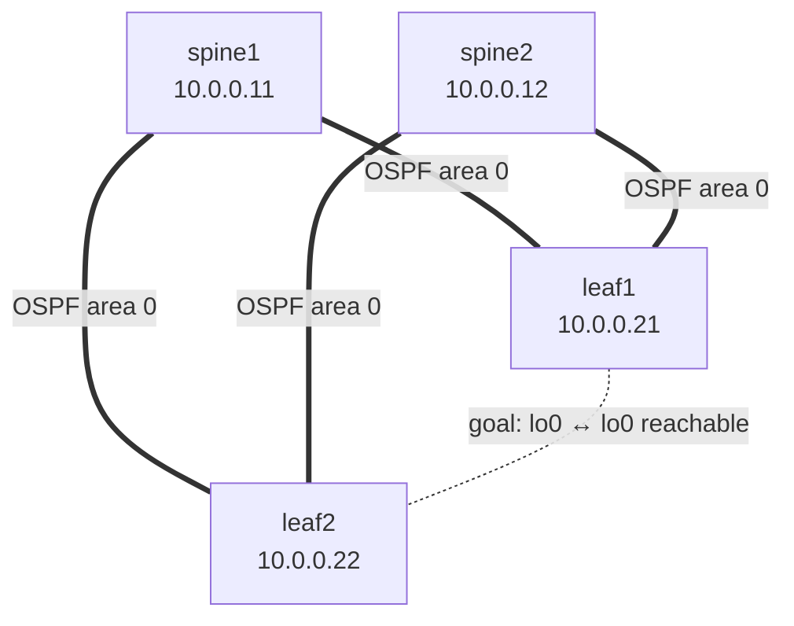

# Step 2 — Underlay: OSPF

## Concept
The underlay has exactly one job: **make every loopback reachable from every
other loopback.** Nothing about VXLAN or EVPN yet — just plain IP reachability
so the VXLAN tunnels (built later) have somewhere to land. All fabric links
join OSPF area 0 as point-to-point; loopbacks are advertised passively.



Every fabric link runs OSPF (solid). The dashed line is the *outcome* we're
after: leaf1's loopback can reach leaf2's loopback, via either spine.

## Config ✅ (validated) — identical on all 4 nodes
```
set protocols ospf area 0 interface lo0.0 passive
set protocols ospf area 0 interface ge-0/0/0.0 interface-type p2p
set protocols ospf area 0 interface ge-0/0/1.0 interface-type p2p
```
Or: `./scripts/apply.sh 01-ospf-ibgp 02`

> Tip: after `commit`, give OSPF ~30s. `show ospf neighbor` reporting "OSPF
> instance is not running" usually just means you ran it before the commit
> settled — re-check.

## Verify — this is the gate
```
show ospf neighbor              → both spines in state "Full"
show route 10.0.0.22            → route to leaf2's loopback via a spine
ping 10.0.0.22 source 10.0.0.21 → MUST succeed
```
Confirmed — leaf-to-leaf loopback reachability, `ttl=63` shows the one spine hop:
```
64 bytes from 10.0.0.22: icmp_seq=0 ttl=63 time=7.3 ms   (0% loss)
```

## Break & observe (optional)
`deactivate protocols ospf area 0 interface ge-0/0/0` on leaf1 → watch the
neighbor drop and the route reconverge via the other spine. Reactivate before
Step 3.

## Checkpoint
Loopback-to-loopback ping works → proceed to Step 3. **If it fails, stop —
nothing above will work.**
