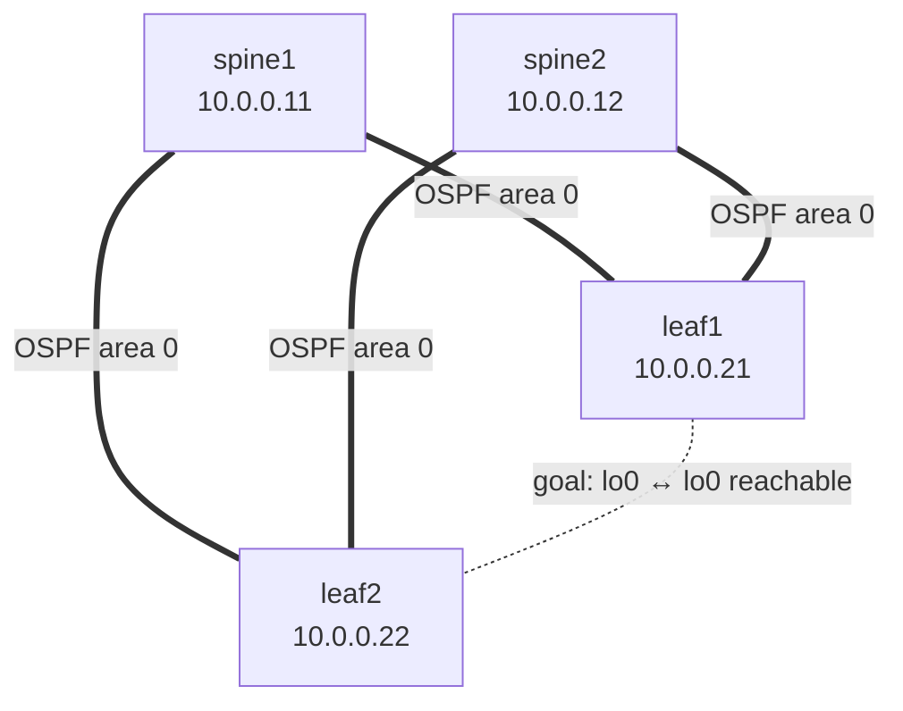

# Step 2 — Underlay: OSPF

## Concept
The underlay has exactly one job: **make every loopback reachable from every
other loopback.** Nothing about VXLAN or EVPN yet — just plain IP reachability
so the VXLAN tunnels (built later) have somewhere to land. All fabric links
join OSPF area 0 as point-to-point; loopbacks are advertised passively.



Every fabric link runs OSPF (solid). The dashed line is the *outcome* we're
after: leaf1's loopback can reach leaf2's loopback, via either spine.

## Config (draft — validate on live fabric)
On **leaf1**:
```
set protocols ospf area 0 interface lo0.0 passive
set protocols ospf area 0 interface et-0/0/0.0 interface-type p2p
set protocols ospf area 0 interface et-0/0/1.0 interface-type p2p
```
Spines do the same for their loopback + both leaf-facing links.

## Verify — this is the gate
```
show ospf neighbor              → both spines in state "Full"
show route 10.0.0.22            → leaf1 has a route to leaf2's loopback via OSPF
ping 10.0.0.22 source 10.0.0.21 → MUST succeed
```

## Break & observe (optional)
`deactivate protocols ospf interface et-0/0/0` on leaf1 → watch the neighbor
drop and the route reconverge via the other spine. Reactivate before Step 3.

## Checkpoint
Loopback-to-loopback ping works → proceed to Step 3. **If it fails, stop —
nothing above will work.**
