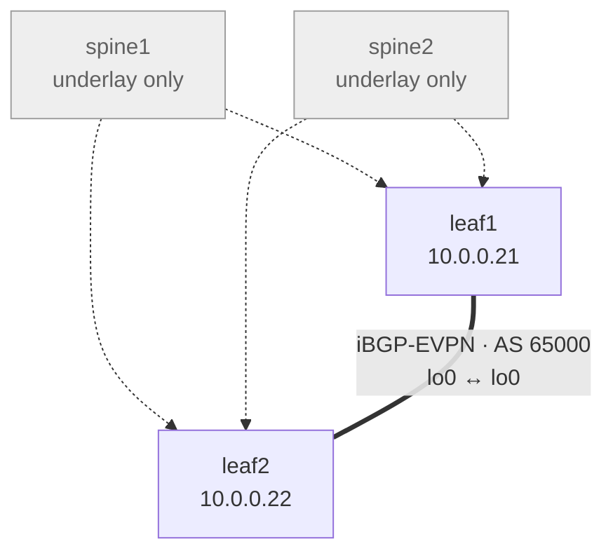

# Step 3 — Overlay: iBGP-EVPN (full mesh)

## Concept
Now the leaves peer **loopback-to-loopback** and carry the `evpn` address
family. In this full-mesh design the **leaves are the VTEPs and peer directly
with each other**; the spines stay pure IP transport and run no EVPN. With two
leaves that is a single iBGP session.



Dotted = physical underlay paths (spines just forward IP). Thick line = the
single EVPN control-plane session between the two VTEPs. The session rides *over*
the underlay — it doesn't touch the spines' BGP (they have none).

## Config ✅ (validated) — leaves only, spines get nothing
On **leaf1**:
```
set routing-options autonomous-system 65000
set protocols bgp group overlay type internal
set protocols bgp group overlay local-address 10.0.0.21
set protocols bgp group overlay family evpn signaling
set protocols bgp group overlay neighbor 10.0.0.22        # leaf2
```
leaf2 is the mirror (`local-address 10.0.0.22`, `neighbor 10.0.0.21`).
Or: `./scripts/apply.sh 01-ospf-ibgp 03`

## Verify
```
show bgp summary
   → peer 10.0.0.22, state "Establ"; table bgp.evpn.0 present
```
Confirmed:
```
Peer            AS      InPkt  OutPkt  ...  State|#Active/Received/Accepted
10.0.0.22       65000   4      3            Establ
  bgp.evpn.0: 0/0/0/0
```
Two things that look alarming but are **normal**:
- `Warning: License key missing; requires 'bgp' license` — vJunos is an eval
  image; it warns but runs BGP fully.
- `bgp.evpn.0: 0/0/0/0` — session up, nothing to advertise yet. Routes arrive
  once a VNI has an active member (Step 5).

## Checkpoint
BGP EVPN session `Established` → proceed to Step 4.
