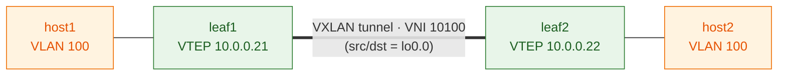

# Step 4 — EVPN + VXLAN glue

## Concept
This is where EVPN turns on. Three pieces bolt together: `protocols evpn`
(encapsulation + which VNIs), `switch-options` (VTEP source = lo0.0, RD, RT),
and a VLAN-to-VNI mapping. The instant both leaves commit, each advertises a
**Type-3 (IMET)** route — "I have VNI 10100, send me BUM traffic for it" — and
a VXLAN tunnel forms between the leaf loopbacks.



The VXLAN tunnel is sourced from each leaf's `lo0.0` (reachable thanks to Step 2)
and carries VNI 10100. A host frame entering leaf1 in VLAN 100 gets wrapped in
VXLAN, crosses the underlay to leaf2's loopback, is unwrapped, and delivered in
VLAN 100 — the two hosts believe they share one L2 segment.

## Config (draft — validate on live fabric)
On **leaf1** (leaf2 mirrors with its own RD):
```
set protocols evpn encapsulation vxlan
set protocols evpn extended-vni-list all
set switch-options vtep-source-interface lo0.0
set switch-options route-distinguisher 10.0.0.21:1
set switch-options vrf-target target:65000:1
set vlans v100 vlan-id 100
set vlans v100 vxlan vni 10100
```

## Verify
```
show evpn database                          → local VNI 10100 present
show route table bgp.evpn.0                 → Type-3 route learned from leaf2
show ethernet-switching vxlan-tunnel-end-point remote
                                            → tunnel to leaf2 loopback, up
```

## Checkpoint
Type-3 route from the peer + tunnel up → proceed to Step 5.
