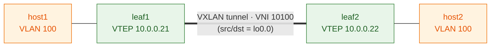

# Step 4 — EVPN + VXLAN glue

## Concept
This is where EVPN turns on. Three pieces bolt together: `protocols evpn`
(encapsulation + which VNIs), `switch-options` (VTEP source = lo0.0, RD, RT),
and a VLAN-to-VNI mapping. The instant both leaves commit, each advertises a
**Type-3 (IMET)** route — "I have VNI 10100, send me BUM traffic for it" — and
a VXLAN tunnel forms between the leaf loopbacks.



The VXLAN tunnel is sourced from each leaf's `lo0.0` (reachable thanks to Step 2)
and carries VNI 10100. A host frame entering leaf1 in VLAN 100 gets wrapped in
VXLAN, crosses the underlay to leaf2's loopback, is unwrapped, and delivered in
VLAN 100 — the two hosts believe they share one L2 segment.

## Config ✅ (validated) — leaves only; RD differs per leaf
On **leaf1** (leaf2 mirrors with RD `10.0.0.22:1`):
```
set protocols evpn encapsulation vxlan
set protocols evpn extended-vni-list all
set switch-options vtep-source-interface lo0.0
set switch-options route-distinguisher 10.0.0.21:1
set switch-options vrf-target target:65000:1
set vlans v100 vlan-id 100
set vlans v100 vxlan vni 10100
```
Or: `./scripts/apply.sh 01-ospf-ibgp 04`

## ⚠️ Key Junos behavior — no Type-3 yet, and that's correct
After committing this, `show route table bgp.evpn.0` is **still empty** and
`show bgp summary` shows the EVPN instance (`default-switch.evpn.0`) but 0 routes.

**This is not a bug.** Unlike Cisco NX-OS (which advertises the VNI as soon as
it's defined), **Junos only originates the Type-3 (IMET) route once the VLAN has
an operationally-up member interface.** VLAN 100 has no ports in it yet — so
nothing to flood to, so no advertisement. The IMET route appears in **Step 5**,
the moment the access port comes up.

## Verify (what to expect *now*)
```
show configuration vlans          → v100 + vxlan vni 10100 present
show configuration switch-options → vtep-source-interface / RD / vrf-target
show bgp summary                  → default-switch.evpn.0 listed, 0/0/0/0
```

## Checkpoint
Config committed on both leaves + `default-switch.evpn.0` appears in
`show bgp summary` → proceed to Step 5 (where it all lights up).
