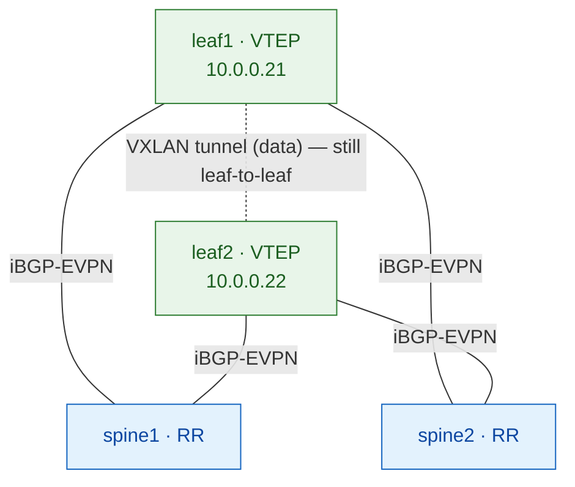

# Lab 02 — OSPF underlay + iBGP-EVPN with spine route-reflectors ⭐

> **Complete, self-contained guide.** The **production** VXLAN-EVPN design. Same
> 2×2 fabric as [lab 01](../01-ospf-ibgp/README.md), but the overlay scales:
> leaves peer only to the spines, and the spines reflect EVPN routes between them.
> Read [the Study track](https://etherhtun.github.io/netforge-labs/study/) first.

**Why this is the production design:** full-mesh iBGP (lab 01) needs N×(N-1)/2
sessions — fine for 2 leaves, unmanageable at 20. Real fabrics make the **spines
route reflectors**, so every leaf has just **2 overlay sessions** (to the two
spines), no matter how big the fabric grows.

---

## What you'll build

| Layer    | Choice |
|----------|--------|
| Underlay | OSPF, single area 0 |
| Overlay  | iBGP-EVPN, AS 65000, **spines = route reflectors, leaves = clients** |
| Spines   | run BGP-EVPN as **RR** (`cluster`) — control-plane only, **NOT VTEPs** |
| Services | one L2VNI: VLAN 100 → VNI 10100, two hosts in one subnet |



**⭐ The key idea:** the spine reflects EVPN routes but keeps the **next-hop
unchanged** (the originating leaf's loopback). So the **control plane** goes
leaf → spine → leaf, but the **data plane** (the VXLAN tunnel) is still **leaf →
leaf directly**. The spine never encapsulates a data packet.

**Addresses** (full plan in [common/ipplan.md](../../common/ipplan.md)):

| Device | lo0 | to spine1 | to spine2 |
|--------|-----|-----------|-----------|
| spine1 | 10.0.0.11 | — | — |
| spine2 | 10.0.0.12 | — | — |
| leaf1  | 10.0.0.21 | 10.10.1.1/31 | 10.10.3.1/31 |
| leaf2  | 10.0.0.22 | 10.10.2.1/31 | 10.10.4.1/31 |

> **Interfaces:** `ge-0/0/N` (clab `ethN` → `ge-0/0/(N-1)`). **Login:** `admin` / `admin@123`.

---

## Before you start

- Host set up — see [Host Setup](https://etherhtun.github.io/netforge-labs/host-setup/00-gcp-instance/).
- This lab runs on its own fabric (`clab-evpn-rr-*`).

**⚠️ Pre-flight — only ONE lab at a time.** A 2×2 vJunos fabric needs ~16 GB RAM;
two at once starve the host and boot `unhealthy`. **Before deploying, check
nothing else is running:**
```bash
docker ps --format '{{.Names}}' | grep '^clab-' || echo "clean — nothing running"
```
If anything shows, wipe it first:
```bash
sudo docker rm -f $(docker ps -aq --filter name=clab-)     # force-remove all clab containers
```
(`deploy.sh` and `reset.sh` also **refuse to start** if another fabric is up, so
you can't hit this by accident — but checking first is good habit.)

## How to run it

```bash
./scripts/deploy.sh 02-ospf-ibgp-rr        # boot the fabric (~5-8 min/node)
./scripts/apply.sh  02-ospf-ibgp-rr all    # build every step
# ...or one step at a time: ./scripts/apply.sh 02-ospf-ibgp-rr 03
./scripts/reset.sh  02-ospf-ibgp-rr        # wipe + redeploy clean
```

**Check the fabric is ready** (vJunos takes ~5–8 min/node to boot):
```bash
docker ps --filter "name=clab-evpn-rr" --format "table {{.Names}}\t{{.Status}}"
```
| STATUS shows | Meaning |
|--------------|---------|
| `Up … (health: starting)` | still booting — wait |
| `Up … (healthy)` | ✅ ready — safe to `apply.sh` |

Wait until all four switches read **`(healthy)`** (the two hosts just show `Up`).
Watch it live: `watch -n 5 'docker ps --filter "name=clab-evpn-rr" --format "table {{.Names}}\t{{.Status}}"'`.

> `apply.sh` **waits for each node's CLI on its own**, so you can run it right
> after deploy — it holds until nodes are ready (up to ~2 min/node).

By hand: `ssh admin@clab-evpn-rr-leaf1` (password `admin@123`), `configure`,
paste a step's block, `commit`.

---

# The build

## Step 1 — Fabric: interfaces & loopbacks
**Why:** fabric-link `/31`s + a `/32` loopback per switch. On a leaf, `lo0` is the
router-id, BGP peer address, and VXLAN tunnel source.

**spine1**
```
set interfaces ge-0/0/0 unit 0 family inet address 10.10.1.0/31
set interfaces ge-0/0/1 unit 0 family inet address 10.10.2.0/31
set interfaces lo0 unit 0 family inet address 10.0.0.11/32
set routing-options router-id 10.0.0.11
```
**spine2**
```
set interfaces ge-0/0/0 unit 0 family inet address 10.10.3.0/31
set interfaces ge-0/0/1 unit 0 family inet address 10.10.4.0/31
set interfaces lo0 unit 0 family inet address 10.0.0.12/32
set routing-options router-id 10.0.0.12
```
**leaf1**
```
set interfaces ge-0/0/0 unit 0 family inet address 10.10.1.1/31
set interfaces ge-0/0/1 unit 0 family inet address 10.10.3.1/31
set interfaces lo0 unit 0 family inet address 10.0.0.21/32
set routing-options router-id 10.0.0.21
```
**leaf2**
```
set interfaces ge-0/0/0 unit 0 family inet address 10.10.2.1/31
set interfaces ge-0/0/1 unit 0 family inet address 10.10.4.1/31
set interfaces lo0 unit 0 family inet address 10.0.0.22/32
set routing-options router-id 10.0.0.22
```
**Verify** (leaf1): `show interfaces terse | match "ge-|lo0"`; `ping 10.10.1.0 count 3`.
**✅ Checkpoint:** links up, loopbacks present, `/31` pings → Step 2.

## Step 2 — Underlay: OSPF
**Why:** make every loopback reachable from every other, over both spines.

**Identical on all four switches:**
```
set protocols ospf area 0 interface lo0.0 passive
set protocols ospf area 0 interface ge-0/0/0.0 interface-type p2p
set protocols ospf area 0 interface ge-0/0/1.0 interface-type p2p
```
**Verify** (leaf1): `show ospf neighbor` (both spines Full);
`ping 10.0.0.22 source 10.0.0.21` (ttl=63). **✅ Checkpoint:** loopback ping works → Step 3.

## Step 3 — Overlay: iBGP-EVPN with route-reflectors ⭐
**Why:** the production overlay. **Spines** run BGP-EVPN with a `cluster` id →
that makes them route reflectors. **Leaves** peer only to the two spines (2
sessions each, forever). The spines reflect routes but keep the next-hop = the
originating leaf, so the VXLAN tunnel stays leaf-to-leaf. Plain iBGP would *not*
re-advertise a route from one peer to another — reflection is exactly what fixes
that.

**spine1 (RR)** — spine2 mirrors with `local-address`/`cluster` = 10.0.0.12
```
set routing-options autonomous-system 65000
set protocols bgp group overlay type internal
set protocols bgp group overlay local-address 10.0.0.11
set protocols bgp group overlay family evpn signaling
set protocols bgp group overlay cluster 10.0.0.11
set protocols bgp group overlay neighbor 10.0.0.21
set protocols bgp group overlay neighbor 10.0.0.22
```
**leaf1 (RR client)** — leaf2 mirrors with `local-address 10.0.0.22`
```
set routing-options autonomous-system 65000
set protocols bgp group overlay type internal
set protocols bgp group overlay local-address 10.0.0.21
set protocols bgp group overlay family evpn signaling
set protocols bgp group overlay neighbor 10.0.0.11
set protocols bgp group overlay neighbor 10.0.0.12
```
**Verify** (leaf1): `show bgp summary` → peers to **both spines** (`10.0.0.11`,
`10.0.0.12`) `Establ`. (0 routes until Step 5 — expected.)
**✅ Checkpoint:** leaf peers to both spines → Step 4.

## Step 4 — EVPN + VXLAN glue
**Why:** turn on the VTEP on the **leaves** (spines get none — they're RRs, not
VTEPs). RD is unique per leaf; RT is shared per VNI.

**leaf1** (leaf2 mirrors, RD `10.0.0.22:1`)
```
set protocols evpn encapsulation vxlan
set protocols evpn extended-vni-list all
set switch-options vtep-source-interface lo0.0
set switch-options route-distinguisher 10.0.0.21:1
set switch-options vrf-target target:65000:1
set vlans v100 vlan-id 100
set vlans v100 vxlan vni 10100
```
**⚠️ Expect NO routes yet** — Junos advertises a VNI only once its VLAN has an up
member (Step 5). **✅ Checkpoint:** `show bgp summary` lists `default-switch.evpn.0` → Step 5.

## Step 5 — Services: attach hosts & prove it
**5a — access ports, leaf1 and leaf2 (same):**
```
set interfaces ge-0/0/2 unit 0 family ethernet-switching interface-mode access
set interfaces ge-0/0/2 unit 0 family ethernet-switching vlan members v100
```
Confirm (leaf1): `show route table bgp.evpn.0` → Type-3 routes appear; tunnel forms.

**5b — host IPs (clab host shell, not Junos):**
```
docker exec clab-evpn-rr-host1 sh -c "ip addr add 10.100.10.10/24 dev eth1; ip link set eth1 up"
docker exec clab-evpn-rr-host2 sh -c "ip addr add 10.100.10.11/24 dev eth1; ip link set eth1 up"
docker exec clab-evpn-rr-host1 ping -c3 10.100.10.11
```
**✅ Checkpoint — the finish line:** 0% packet loss. 🎉

---

## Verify checklist (the RR-specific checks matter)

- [ ] `show ospf neighbor` (leaf) — both spines `Full`
- [ ] `show bgp summary` (leaf) — peers to **both spines**, `Establ`
- [ ] `show bgp summary` (spine) — peers to **both leaves**, `Establ`
- [ ] ⭐ `show route table bgp.evpn.0` (**spine**) — EVPN routes **present** (the
      RR retains & reflects them)
- [ ] ⭐ `show route table bgp.evpn.0 extensive | match "Protocol next hop"` (leaf)
      — next-hop is the far **leaf** (`10.0.0.22`), **not** a spine
- [ ] host1 → host2 ping — 0% loss

Those two ⭐ checks are what make this *production RR*: the spine holds/reflects
routes, but never sits in the data path.

## Break-it exercises

1. **Kill one spine:** `deactivate protocols bgp` + `commit` on spine1 → hosts
   **still ping** (leaf still has the session to spine2). This is why you run two
   RRs. Reactivate.
2. **Remove the `cluster`:** `delete protocols bgp group overlay cluster ...` on a
   spine → it stops reflecting (plain iBGP won't relay peer-to-peer), so the far
   leaf loses routes. **This teaches *why* RR exists.** Restore.
3. **VNI mismatch / VTEP source** — same as lab 01 (breaks the tunnel).

## Open validation item

⭐ On first live run, confirm check #4 above (spine's `bgp.evpn.0` holds routes).
On Junos it should, since the spine has no VRF to filter into — but Cisco needs a
`retain route-target all` knob, so this is worth confirming. Update this section
with the result.
