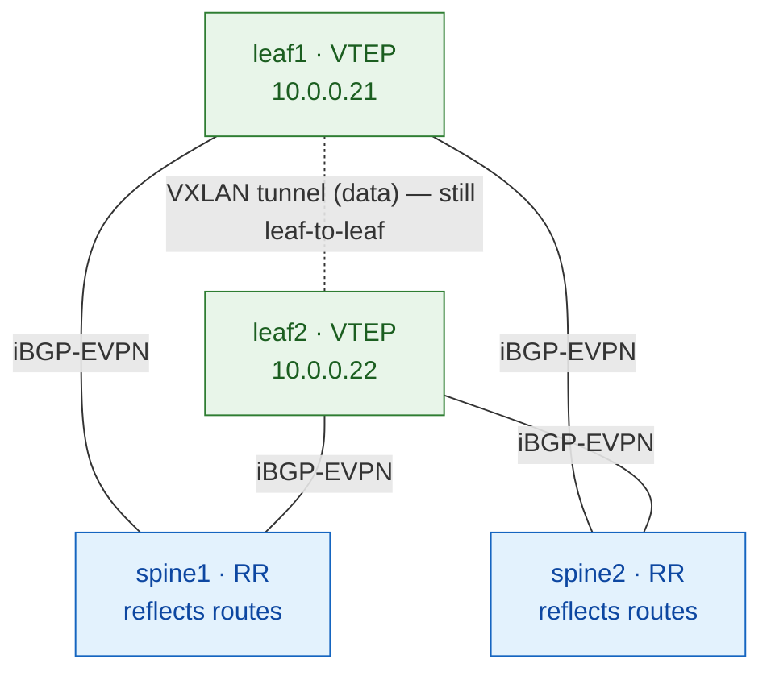

# Lab 02 — OSPF underlay + iBGP-EVPN with **spine route-reflectors**

The **production-grade** overlay. Same 2×2 fabric as lab 01, but the overlay
scales: leaves peer only to the spines, and the spines reflect EVPN routes
between them.

> **Why this exists:** full-mesh iBGP (lab 01) needs N×(N-1)/2 sessions — fine
> for 2 leaves, unmanageable at scale. Real fabrics use **spine-as-route-reflector**
> so each leaf has just 2 overlay sessions (to the 2 spines), forever.

## Design

| Layer    | Choice |
|----------|--------|
| Underlay | OSPF (single area 0) — *identical to lab 01* |
| Overlay  | iBGP-EVPN, AS 65000, **spines = route reflectors, leaves = clients** |
| Spines   | run BGP-EVPN as **RR** (`cluster`) — control-plane only, **NOT VTEPs** |
| Services | one L2VNI (VLAN 100 → VNI 10100) — *identical to lab 01* |

## ⭐ The key idea: spine is control-plane only

The spine reflects EVPN routes but **keeps the next-hop unchanged** (the
originating leaf's loopback). So:



The **control plane** goes leaf → spine → leaf (reflected). The **data plane**
(the VXLAN tunnel) is still **leaf → leaf directly**. The spine never
encapsulates a data packet — it's not a VTEP.

## What's different from lab 01

**Only Step 3 (the overlay).** Everything else is identical.

| Step | vs lab 01 |
|------|-----------|
| 1 · Fabric | identical → see [lab 01 step 1](../01-ospf-ibgp/steps/01-fabric.md) |
| 2 · Underlay OSPF | identical → see [lab 01 step 2](../01-ospf-ibgp/steps/02-underlay-ospf.md) |
| **3 · Overlay (RR)** | **[different — see steps/03-overlay-rr.md](steps/03-overlay-rr.md)** |
| 4 · EVPN + VXLAN | identical → see [lab 01 step 4](../01-ospf-ibgp/steps/04-evpn-vxlan.md) |
| 5 · Services | identical → see [lab 01 step 5](../01-ospf-ibgp/steps/05-services-verify.md) |

## Run it

```bash
./scripts/deploy.sh 02-ospf-ibgp-rr       # boot the fabric
./scripts/apply.sh  02-ospf-ibgp-rr all   # build it (RR overlay and all)
# host setup + ping (apply.sh prints the commands)
./scripts/reset.sh  02-ospf-ibgp-rr       # wipe & redo
```

Or per step: `./scripts/apply.sh 02-ospf-ibgp-rr 03` applies just the RR overlay.

## Status

🏗️ Built from the validated lab-01 pattern; **overlay pending live validation**
(see the one open check in [steps/03-overlay-rr.md](steps/03-overlay-rr.md) — does
the Junos spine retain EVPN routes as a non-VTEP RR).
